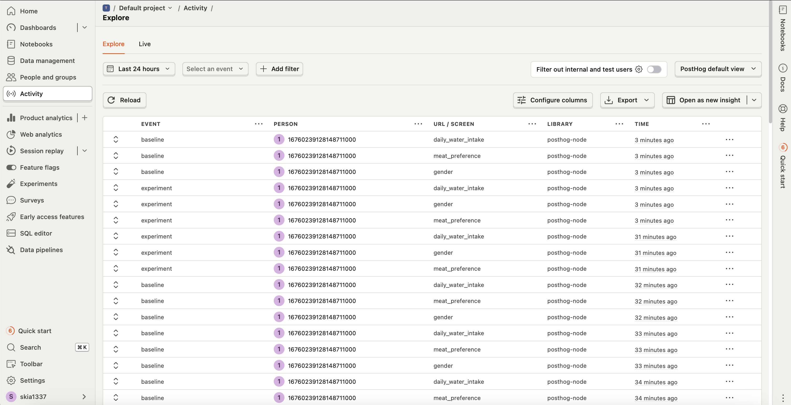
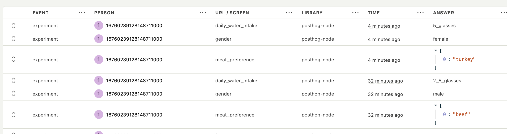

## Setup

```bash
# bun
bun i -g vercel
bun i

vercel login
vercel dev
```

could search //HINT: in codebase

### Analytics Integration

some posthog setup, for funnels will be better to use their initial feature-flag feature and experiment, but for demo i just gather some answers from our funnel and total sessions with diff funnel setup:

_my activity_

_answers as attribution_

_total sessions_

### **Goal**

Build a funnel-driven website that dynamically assigns users a predefined screen sequence (baseline or experimental) and ensures a consistent experience through server-side rendering.

### Context

This is a simulation of a marketing funnel designed to collect user inputs (e.g., gender, preferences) across multiple screens with unique URLs.

Users are randomly assigned a configuration on their first visit, which must persist across reloads. Mid-sequence visits should redirect to the landing page to start the funnel.

### **Tech Stack**

- Nuxt 3
- TypeScript
- TailwindCSS

### Requirements

- **Funnel Configurations**
  - These configurations define the sequence of screens and their behavior for the funnel:
    - **Baseline**
      ```tsx
      const config_baseline = {
        screens: [
          {
            id: "index",
            component: "LandingV1",
            props: {
              title: {
                text: "Hello",
                classes: "text-emerald-400",
              },
            },
          },
          {
            id: "gender",
            component: "SingleChoiceQuestion",
            props: {
              title: {
                text: "What’s your gender?",
                classes: "text-emerald-400",
              },
              options: [
                { title: "Female", value: "female" },
                { title: "Male", value: "male" },
              ],
            },
          },
          {
            id: "meat_preference",
            component: "MultiChoiceQuestion",
            props: {
              title: { text: "Which meat do you prefer?" },
              options: [
                {
                  title: "Chicken",
                  value: "chicken",
                },
                {
                  title: "Pork",
                  value: "pork",
                },
                {
                  title: "Bacon",
                  value: "bacon",
                },
                {
                  title: "Beef",
                  value: "beef",
                },
                {
                  title: "Turkey",
                  value: "turkey",
                },
                {
                  title: "Fish",
                  value: "fish",
                },
                {
                  title: "Lamb",
                  value: "lamb",
                },
              ],
            },
          },
          {
            id: "daily_water_intake",
            component: "SingleChoiceQuestion",
            props: {
              title: {
                text: "How many glasses of water do you drink per day?",
              },
              options: [
                { title: "I only have coffee or tea", value: "none" },
                { title: "Less than 2 glasses", value: "2_glasses" },
                { title: "About 3-6 glasses", value: "2_5_glasses" },
                { title: "More than 6 glasses", value: "5_glasses" },
              ],
            },
          },
        ],
      };
      ```
    - **Experimental**
      ```tsx
      const config_experiment = {
        screens: [
          {
            id: "index",
            component: "LandingV2",
            props: {
              title: {
                text: "Hello, this is experiment!",
                classes: "text-rose-500",
              },
            },
          },
          {
            id: "meat_preference",
            component: "MultiChoiceQuestion",
            props: {
              title: { text: "Which meat do you prefer?" },
              options: [
                {
                  title: "Chicken",
                  value: "chicken",
                },
                {
                  title: "Pork",
                  value: "pork",
                },
                {
                  title: "Bacon",
                  value: "bacon",
                },
                {
                  title: "Beef",
                  value: "beef",
                },
                {
                  title: "Turkey",
                  value: "turkey",
                },
                {
                  title: "Fish",
                  value: "fish",
                },
                {
                  title: "Lamb",
                  value: "lamb",
                },
              ],
            },
          },
          {
            id: "gender",
            component: "SingleChoiceQuestion",
            props: {
              title: {
                text: "What’s your gender?",
                classes: "text-emerald-400",
              },
              options: [
                { title: "Female", value: "female" },
                { title: "Male", value: "male" },
              ],
            },
          },
          {
            id: "daily_water_intake",
            component: "SingleChoiceQuestion",
            props: {
              title: {
                text: "How many glasses of water do you drink per day?",
              },
              options: [
                { title: "I only have coffee or tea", value: "none" },
                { title: "Less than 2 glasses", value: "2_glasses" },
                { title: "About 3-6 glasses", value: "2_5_glasses" },
                { title: "More than 6 glasses", value: "5_glasses" },
              ],
            },
          },
        ],
      };
      ```
- **Navigation and URLs**
  - Each screen corresponds to a unique URL:
    - Landing page: `/`
    - Other screens: `/s/gender`, `/s/meat_preference`, etc.
  - Clicking "Continue" navigates to the next screen.
- **Server-side Logic**
  - The funnel must be server-side rendered to ensure the user receives pre-rendered content.
  - Assign a random configuration (`config_baseline` or `config_experiment`) when the user first visits the landing page (`/`).
  - Once assigned, the configuration must remain consistent for that user (persisted across page reloads).
  - If a user directly visits a screen URL without an assigned configuration, redirect them to `/` and assign a configuration.
- **Frontend UI**
  - UI design is up to you and will not affect the evaluation.
  - Focus on the mechanics and functionality.
- **Deliverables**
  - Submit your solution as a public GitHub repository with clear instructions on how to run the project locally.

### **Evaluation Criteria**

1. **Functionality:** The funnel behaves as expected with smooth navigation and consistent configuration handling.
2. **Code Quality:** The code is clean, readable, and well-organized, with proper use of TypeScript.
3. **Scalability:** The solution supports easy addition of new screens or configurations.
4. **[Optional] Bonus Points:** Includes, but is not limited to, error handling, form validation, or analytics integration to enhance functionality.
